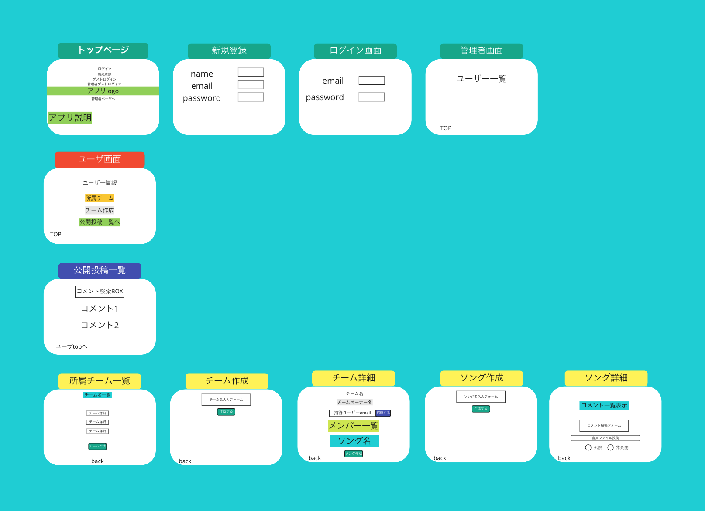
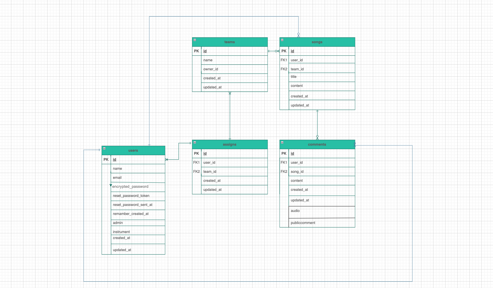
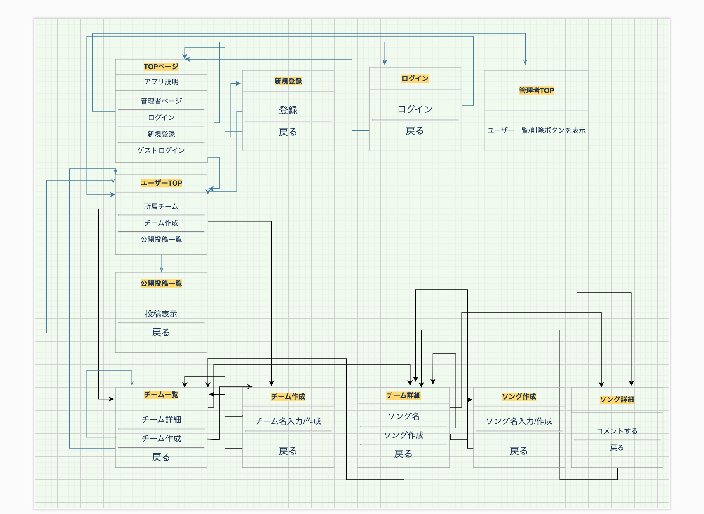

# README

開発言語
----------
Ruby 3.0.1
Ruby on Rails 6.1.7

就業Termの技術
----------
Devise
Ajaxを使ったコメント機能
AWSデプロイ

カリキュラム外の技術
----------
ransack仕様による検索機能

```
$ git clone git@github.com:yukihiro-ikeda/original_app.git
$ cd original_app1
$ bundle
$ rails db:create && rails db:migrate
$ rails s
```

カタログ設計
-----------
https://docs.google.com/spreadsheets/d/1l6h-GYWyzBxEfzPqihJDBTWF4VJbj6qCd-U8tYjpu-Y/edit#gid=519059945

テーブル定義書
-----------
https://docs.google.com/spreadsheets/d/14wfD7Yvca9CuDNZB5ovGCy4H8B3I1omCoQhd1jIZGyM/edit#gid=1994401962

ワイヤーフレーム
-----------
  

ER図
-----------
  


画面遷移図
-----------
  


